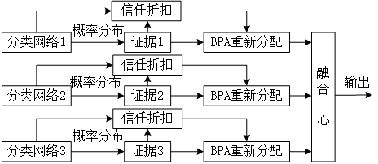

# Enhanced-D-S-Evidence-Theory
Improving D-S Evidence Theory C Language and Python Implementation Based on Trust Discount/基于信任折扣的改进D-S证据理论 C语言和Python实现

论文待发表后贴出

本代码为改进D-S证据理论的C语言和Python实现
## pyCode
代码功能为输入txt文件的长度不限的声音信号和震动信号（需同步），以1024点为一帧分别使用预训练模型对信号进行分析，输出两模型基础概率分布作为证据理论的基础概率指派。

声音信号为提取MFCC特征进行识别，震动信号为直接将信号喂入。

##cCode
cCode为该算法的C语言实现。
